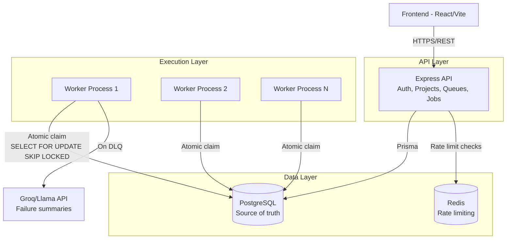
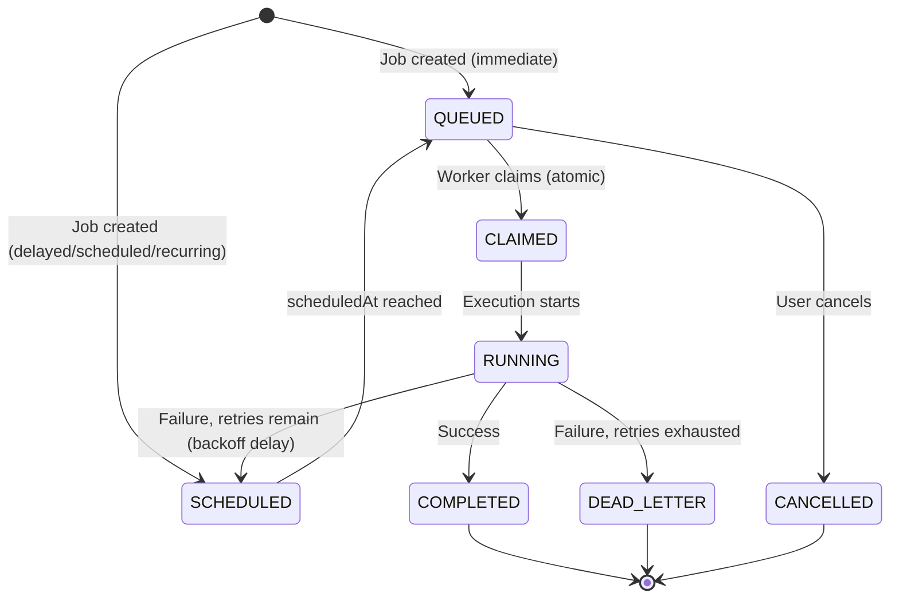

# Architecture

## System Overview

## Job Lifecycle

## Key Design Decisions

### Atomic Job Claiming
Workers claim jobs using PostgreSQL's `SELECT ... FOR UPDATE SKIP LOCKED` inside a transaction. This guarantees that when N workers poll simultaneously, each claims a different job with zero duplicate execution — proven under concurrency testing (see `backend/tests/test-concurrency.ts`).

### Why Postgres row-locking over a separate message queue (e.g. Redis-based)
- Single source of truth: job state, execution history, and claim status all live in one transactional store, avoiding dual-write consistency issues between Postgres and Redis.
- `SKIP LOCKED` was purpose-built for this exact "queue table" pattern and is used in production systems like GoodJob, Oban, and River.
- Redis is still used, but for its actual strength: rate limiting (ephemeral counters), not as a second source of truth for job state.

### Retry Strategy
Configurable per-queue: fixed, linear, or exponential backoff. On failure, if retries remain, the job returns to `SCHEDULED` with a computed `scheduledAt` in the future — the same claim query picks it back up once that time passes, no separate retry queue needed.

### Dead Letter Queue + AI Summaries
When a job exhausts its retries, it moves to `DEAD_LETTER` and a `DeadLetterJob` record is created **atomically together** with the status update (via `prisma.$transaction`) to avoid a race window where the job shows failed but has no DLQ record yet — a bug we found via automated testing and fixed.

An LLM call (Groq/Llama 3.3) generates a plain-English failure summary at this point, giving developers immediate triage context instead of raw stack traces.

### Worker Design
Workers are separate, horizontally-scalable Node processes. Each polls independently, claims work atomically, and reports heartbeats. Killing a worker doesn't lose jobs — claimed-but-abandoned jobs would need a stale-claim reaper (documented as a known gap, see Design Decisions doc).
