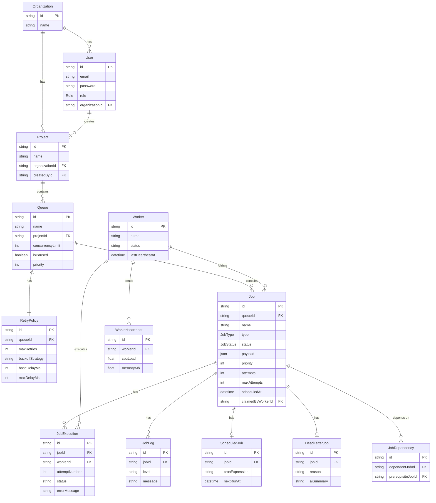

# Entity Relationship Diagram

```mermaid
erDiagram
    Organization ||--o{ User : has
    Organization ||--o{ Project : has
    User ||--o{ Project : creates
    Project ||--o{ Queue : contains
    Queue ||--|| RetryPolicy : has
    Queue ||--o{ Job : contains
    Job ||--o{ JobExecution : has
    Job ||--o{ JobLog : has
    Job ||--o| ScheduledJob : has
    Job ||--o| DeadLetterJob : has
    Job ||--o{ JobDependency : "depends on"
    Worker ||--o{ Job : claims
    Worker ||--o{ WorkerHeartbeat : sends
    Worker ||--o{ JobExecution : executes

    Organization {
        string id PK
        string name
    }
    User {
        string id PK
        string email
        string password
        Role role
        string organizationId FK
    }
    Project {
        string id PK
        string name
        string organizationId FK
        string createdById FK
    }
    Queue {
        string id PK
        string name
        string projectId FK
        int concurrencyLimit
        boolean isPaused
        int priority
    }
    RetryPolicy {
        string id PK
        string queueId FK
        int maxRetries
        string backoffStrategy
        int baseDelayMs
        int maxDelayMs
    }
    Job {
        string id PK
        string queueId FK
        string name
        JobType type
        JobStatus status
        json payload
        int priority
        int attempts
        int maxAttempts
        datetime scheduledAt
        string claimedByWorkerId FK
    }
    JobExecution {
        string id PK
        string jobId FK
        string workerId FK
        int attemptNumber
        string status
        string errorMessage
    }
    ScheduledJob {
        string id PK
        string jobId FK
        string cronExpression
        datetime nextRunAt
    }
    DeadLetterJob {
        string id PK
        string jobId FK
        string reason
        string aiSummary
    }
    JobDependency {
        string id PK
        string dependentJobId FK
        string prerequisiteJobId FK
    }
    Worker {
        string id PK
        string name
        string status
        datetime lastHeartbeatAt
    }
    WorkerHeartbeat {
        string id PK
        string workerId FK
        float cpuLoad
        float memoryMb
    }
    JobLog {
        string id PK
        string jobId FK
        string level
        string message
    }
```
